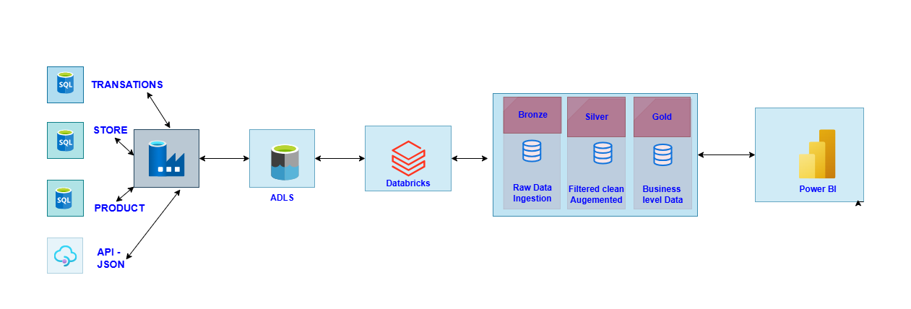
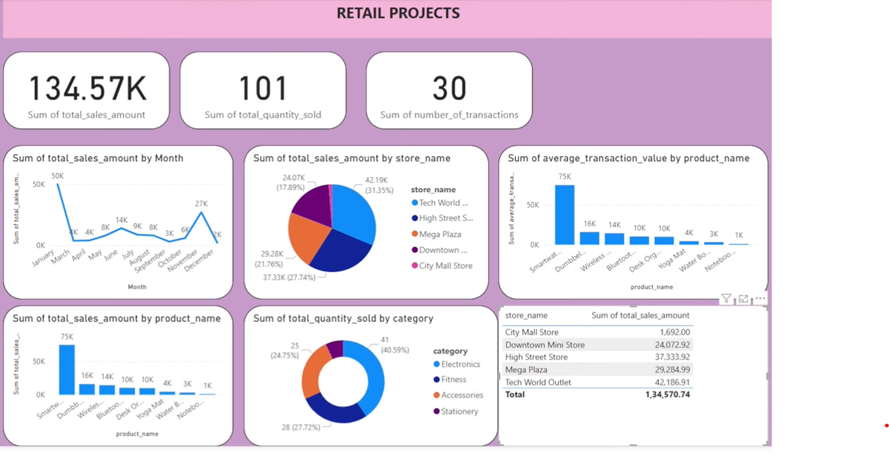

# Retail Data Engineering Project

# 📌 Project Overview

 This project implements an **end-to-end retail data pipeline** using Azure Data Engineering tools such as **Azure Data Factory (ADF), Azure Data Lake Storage(ADLS), Azure Databricks and Power BI.** 
The pipeline ingests data from multiple sources, transforms it into a structured **data lake format (Bronze → Silver → Gold layers),** and enables interactive **business reporting and analytics** through Power BI dashboards.

---

## ⚙️ Tech Stack & Azure Services Used

###  **🔹Tech Stack**
- **Python (PySpark) –** Data cleaning, transformations, aggregations
- **SQL –** Source database schema & queries
- **JSON / API –** Customer master data ingestion
- **Delta Lake –** Optimized storage format for Silver & Gold layers
- **Power BI –** Interactive dashboards & reporting

### **🔹 Azure Services Used**

- **Azure Data Factory (ADF) →** Orchestration Data ingestion from SQL DB & API
- **Azure Data Lake Storage (ADLS) →** Central data lake with Bronze, Silver, Gold zones
- **Azure Databricks →** Data cleaning, transformation, aggregation and data engineering(ETL pipeline with PySpark)
- **Azure SQL Database →** Source system for transactions, products, and stores
- **Power BI** → Business intelligence, visualization, Reporting & dashboards

---

## 📂 Data Sources

**1. Azure SQL Database**
- **Transactions** (sales data)
- **Stores** (store details)
- **Products** (catalog details)

**2. API / JSON**
- **Customers** (customer master data in JSON format)

---

## 🏗️ Architecture
```
graph LR
A[Azure SQL - Transactions] --> B[ADF]
C[Azure SQL - Stores] --> B
D[Azure SQL - Products] --> B
E[API - Customers JSON] --> B
B --> F[ADLS - Bronze]
F --> G[Databricks - Silver Layer]
G --> H[Databricks - Gold Layer]
H --> I[Power BI Reports]
```

- **Bronze Layer →** Raw ingestion from SQL & JSON
- **Silver Layer →** Cleaned, standardized, joined dataset
- **Gold Layer →** Aggregated business-level KPIs for reporting

---

## ⚙️ Data Processing

### Bronze Layer
- **Objective:** Store raw data files in ADLS from SQL DB & JSON API.
- **File Formats:** Parquet (for SQL data) and JSON/Parquet (for customer data).

### Silver Layer
- **ETL Process:** Cleans using PySpark (`retail projects - multiple tables (1).py`).
  - Schema alignment (casting datatypes)
  - Removing duplicates
  - Joining of customers, stores, products, and transactions
  - Adding derived column: `total_amount = quantity * price`

**Gold Layer**
- **Aggregation:** Compute business KPIs:
  - `total_quantity_sold`
  - `total_sales_amount`
  - `number_of_transactions`
  - `average_transaction_value`
- **Storage:** Persisted as Delta tables to enable optimized analytics.

---

## 📊 Business Requirements & KPIs

1. **Total Sales by Store and Category**
   - **Metric:** SUM(total_sales_amount)
   - **Dimensions:** Store, Category
   - **Visualization:** Grouped Bar Chart

2. **Daily Sales Trend by Product**
   - **Metric:** SUM(total_sales_amount)
   - **Dimensions:** Date, Product
   - **Visualization:** Line Chart (time series)

3. **Average Order Value per Store**
   - **Metric:** SUM(total_sales_amount) / COUNT(transaction_id)
   - **Visualization:** Column Chart (per store)

4. **Heatmap: Store vs Sales**
   - **Metric:** SUM(total_sales_amount)
   - **Dimensions:** Store × Product/Category
   - **Visualization:** Heatmap (color intensity representing sales)
---  

## 📑 Power BI Reporting

Directly connect Power BI to the Gold Layer Delta tables to create interactive dashboards, including:

- **Sales by Store & Category**
- **Daily Sales Trend by Product**
- **Average Order Value per Store**
- **Heatmap of Store vs Sales**


---
## 🚀 Deployment Steps

1. **Deploy SQL Schema & Sample Data**
   - Use `SCRIPT SQL.txt` to create source tables (products, stores, transactions) and insert sample data.
2. **Upload Customer Data**
   - Place `customers.json` into the appropriate location (API/Blob) for ingestion.
3. **Configure and Run ADF Pipelines**
   - The pipeline copies data from SQL and JSON sources into the ADLS Bronze layer.
4. **Execute Databricks Notebook**
   - Run `retail projects - multiple tables (1).py` to transform Bronze data into Silver and create Gold tables.
5. **Connect Power BI**
   - Link Power BI to the Gold Layer Delta tables and build dashboards based on KPIs.

---

## 📜 Code & Notebooks

1. **SQL Script → `SCRIPT SQL.txt`**
   - Creates necessary source tables and inserts sample data.
2. **JSON Data → `customers.json`**
   - Contains sample customer master data for API ingestion.
3. **Databricks Notebook → `retail projects - multiple tables (1).py`**
   - Implements the ETL pipeline:
     - Ingests raw Bronze data
     - Cleans and standardizes data into Silver
     - Aggregates metrics for business KPIs into Gold

---

## 🖥️ PySpark ETL Highlights

**Load Bronze Data:**
```python
df_transactions = spark.read.parquet('/mnt/retail_project/bronze/transaction/')
df_products = spark.read.parquet('/mnt/retail_project/bronze/product/')
df_stores = spark.read.parquet('/mnt/retail_project/bronze/store/')
df_customers = spark.read.parquet('/mnt/retail_project/bronze/customer/')
```

**Transform into Silver:**
```python
from pyspark.sql.functions import col

df_transactions = df_transactions.select(
    col("transaction_id").cast("int"),
    col("customer_id").cast("int"),
    col("product_id").cast("int"),
    col("store_id").cast("int"),
    col("quantity").cast("int"),
    col("transaction_date").cast("date")
)

df_customers = df_customers.select(
    "customer_id", "first_name", "last_name", "email", "city", "registration_date"
).dropDuplicates(["customer_id"])
```

**Join All Data (Silver Layer):**
```python
df_silver = df_transactions \
    .join(df_customers, "customer_id") \
    .join(df_products, "product_id") \
    .join(df_stores, "store_id") \
    .withColumn("total_amount", col("quantity") * col("price"))
```

**Gold Aggregations:**
```python
from pyspark.sql.functions import sum, countDistinct, avg

gold_df = df_silver.groupBy(
    "transaction_date", "product_id", "product_name", "category",
    "store_id", "store_name", "location"
).agg(
    sum("quantity").alias("total_quantity_sold"),
    sum("total_amount").alias("total_sales_amount"),
    countDistinct("transaction_id").alias("number_of_transactions"),
    avg("total_amount").alias("average_transaction_value")
)
```

---

## 📊 Power BI Dashboards

- **Key Visuals:**
  - Sales by Store & Category
  - Daily Sales Trend by Product
  - Average Order Value per Store
  - Heatmap: Store vs Sales



---

## 🔐 Security & Governance

- **Data Security:** Implement Role-Based Access Control (RBAC) on ADLS and Databricks.
- **Data Encryption:** Ensure encryption at rest for data in ADLS and SQL, and in transit using HTTPS/SSL.
- **Data Governance:** Integrate with Azure Purview for comprehensive data cataloging, lineage tracking, and classification.
- **Power BI:** Utilize Row-Level Security (RLS) to manage and control data access.

---

## 📦 Repository Structure

```
├── customers.json                  # Customer data (JSON)
├── SCRIPT SQL.txt                  # SQL schema and sample inserts
├── retail projects - multiple tables (1).py   # Databricks ETL script
├── docs/
│   ├── architecture.png            # Embedded architecture diagram
│   └── dashboard_wireframes.png    # Mockups of Power BI dashboards
└── README.md                       # Project documentation (this file)
```

---

## 📈 Results & Insights

- **Sales Performance:** Identification of top-performing stores and product categories.
- **Trend Analysis:** Detailed daily sales trends across various products.
- **Order Value Analysis:** Measurement of average order value per store to evaluate revenue efficiency.
- **Regional Strengths:** Visualization of store performance against sales using heatmaps to understand regional variations.

---

## 📌 Future Enhancements

- **Pipeline Scheduling:** Automate pipeline triggers via ADF for streamlined scheduling.
- **Incremental Data Loads:** Implement Change Data Capture (CDC) for transactions to optimize data ingestion.
- **Enhanced Security:** Further refine RBAC and integrate additional compliance measures.
- **Analytics Expansion:** Incorporate machine learning models for demand forecasting.
- **Data Warehouse Integration:** Extend the Gold Layer functionality into Azure Synapse for enterprise-grade warehousing.

---
